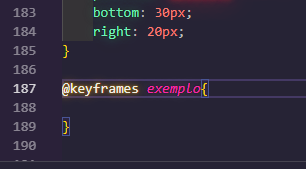

# Keyframes

- Pontos chave, definimos pontos chaves em determinados períodos de tempo e colocamos mudanças no mesmo.

- Sempre o 0% será o estado inicial da animação, ou seja, o estado onde ainda não aconteceu nenhumma mutação no elemento. Ao adicionar um além ao 0% (1 ao 100%) você já irá colocar as mudanças que queres fazer na animação.

- Animação mudará gradualmente do estilo atual para o novo estilo em determinados momentos

## Estrutura da propriedade animation

~~~CSS exemplo
.btn{
    animation: nome, tempo, suavidade(ease), repetições, tipo de caminho(alternate por exemplo);
}
~~~

`OBS: se atentar com o inicio da animação e quando ela será executada, pois se não tiver algum evento que dispara ela, a animação será carregada junto com toda a página. Você pode fazer isso com JS, ou você pode fazer isso no próprio CSS com um hover por exemplo.`

~~~CSS exemplo
.btn:hover{
    animation: nome, tempo, suavidade(ease), repetições, tipo de caminho(alternate por exemplo);
}
~~~

## Propriedades

| Propriedade | Ação |
|---|---|
| animation-name | vincula a animação ao elemento |
| animation-duration | tempo da animação |

